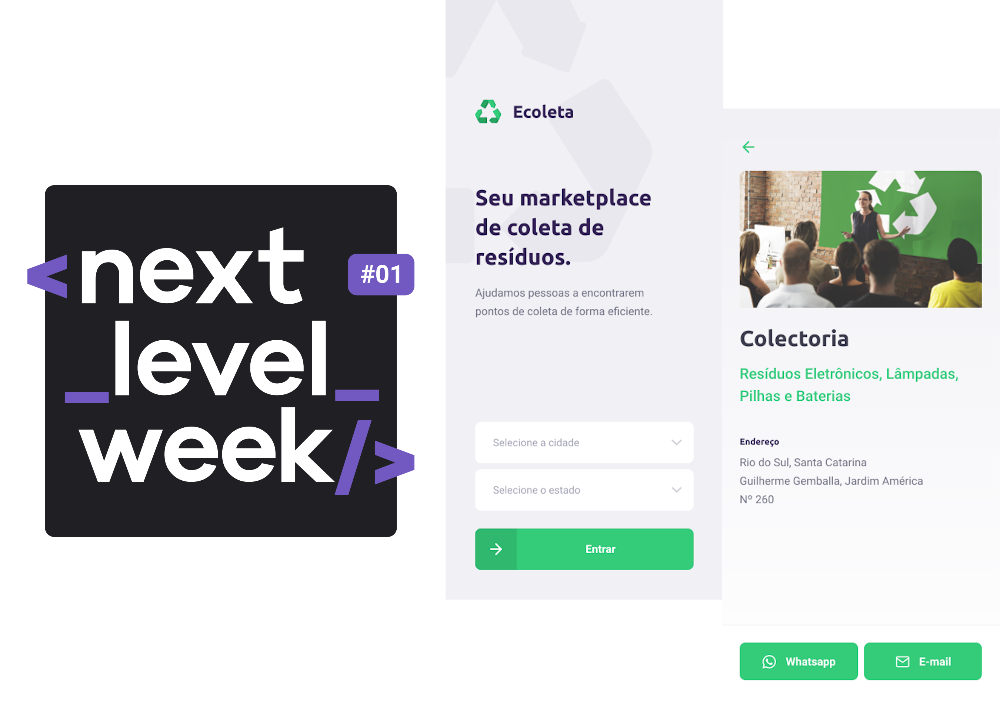
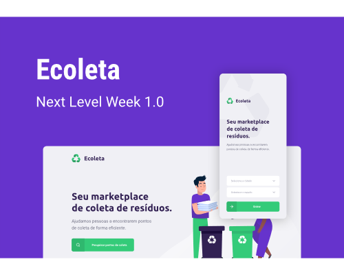

<h1 align="center">
  
</h1>

<h2>
  Next Level Week #01 - Ecoleta - Alternative Server Java
</h2>

<p align="center">
  <a href="https://www.linkedin.com/in/leonardo-panichi-504022117/">
    
  </a>

  <a href="https://github.com/LeoPanichi/rocketseat-nlw-01/commits/master">
    
  </a>

  
   <a href="https://github.com/LeoPanichi/rocketseat-nlw-01/stargazers">
    
  </a>
</p>

<p align="center">
  <a href="#-next-level-week">Next Level Week</a>&nbsp;&nbsp;&nbsp;-&nbsp;&nbsp;&nbsp;
  <a href="#-project">Project</a>&nbsp;&nbsp;&nbsp;-&nbsp;&nbsp;&nbsp;
  <a href="#-Technologies">Technologies</a>&nbsp;&nbsp;&nbsp;-&nbsp;&nbsp;&nbsp;
  <a href="#-layout">Layout</a>&nbsp;&nbsp;&nbsp;-&nbsp;&nbsp;&nbsp;
  <a href="#-how-to-use">How to install and run</a>&nbsp;&nbsp;&nbsp;-&nbsp;&nbsp;&nbsp;
  <a href="#-license">License</a>
</p>

# 💭 Next Level Week?

Next Level Week is a technology week focused on learning web development using the latest technologies in the job market.

## 🖥 Project 

Ecoleta is a project developed based on international environment week. 
That aims to connect people to companies that collect specific waste such as light bulbs, batteries, cooking oil, etc.

<h1 align="center">
  
</h1>

## 🛠 Technologies

This project was developed with the following technologies:

- [Java][java]
- [Spring Boot][springboot]
- [Docker][docker]
- [PostgreSQL][postgresql]

## 📐 Layout

To access the layout of the project use [Figma](https://www.figma.com/file/1SxgOMojOB2zYT0Mdk28lB/).

## ℹ️ How To Use

To clone and run this application, you'll need [Git](https://git-scm.com), [Spring Boot][springboot] and [Docker][docker] installed on your computer.

From your command line:

### Run Project

```bash
# Clone this repository
$ git clone https://github.com/LeoPanichi/rocketseat-nlw-01-server-alt2

# Go into the repository
$ cd rocketseat-nlw-01-server-alt2/server

# Create Docker Image
# Run Docker Image on port 5432
# Run Migrations
# Run Seeds
# Run Spring Boot Application
$ .\\mvnw spring-boot:run

# running on port 8080
```

## 📝 License

This project is under the MIT license. See the [LICENSE](https://github.com/LeoPanichi/rocketseat-nlw-01-server-alt1/blob/master/LICENSE) for details.


Made by Leonardo Panichi
[Linkedin](https://www.linkedin.com/in/leonardo-panichi-504022117/)

[java]: https://www.oracle.com/br/java/technologies/downloads
[springboot]: https://spring.io/guides/gs/rest-service
[docker]: https://www.docker.com/
[postgresql]: https://www.postgresql.org/download/